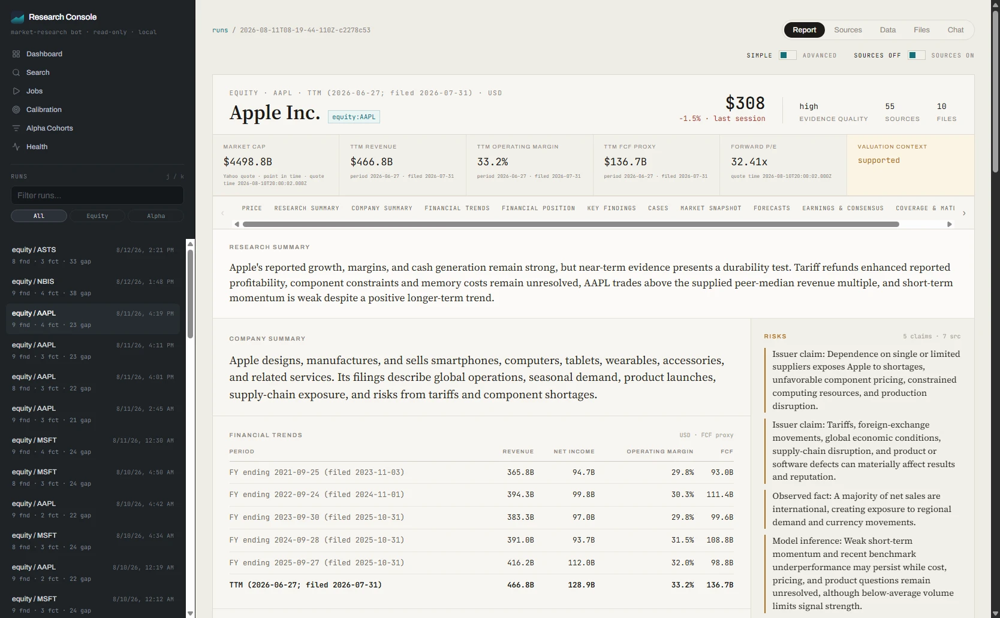

<p align="center">
  
</p>

<h1 align="center">market-bot</h1>

<p align="center">
  A Bun + TypeScript CLI that turns public market data into sourced research artifacts — with measurable predictions, scoring, and calibration.
</p>

<p align="center">
  <a href="https://github.com/nejcm/market-bot/actions/workflows/ci.yml"></a>
  <a href="./LICENSE"></a>
</p>

> **Work in progress.** This project is under active development. CLI commands, configuration, and output formats may change without notice.

> **Research-only.** Reports are sourced research views — not trading advice. No buy/sell calls, position sizing, execution, or portfolio actions. Predictions are observable forecasts scored for calibration, not trade signals.

<br />
<br />
<p align="center">
  
</p>
<br />
<br />

## Quick start

**Requirements:** [Bun](https://bun.sh) ≥ 1.1 (tested with 1.3.x) and an LLM provider key (or a [Codex](#codex-chatgpt-subscription-no-api-key-required) login). Nothing else is required — market data from Yahoo Finance, CoinGecko, ApeWisdom, and SEC EDGAR needs no keys. Free [FRED](https://fred.stlouisfed.org/) and SEC credentials add macro and filing evidence; see [External services](#external-services).

```sh
git clone https://github.com/nejcm/market-bot.git
cd market-bot
bun install
bunx lefthook install   # optional — git hooks for contributors
cp .env.example .env    # see comments in .env.example for required and optional keys
```

Run an equity market overview:

```sh
export OPENAI_API_KEY=sk-...
bun run src/cli.ts market-overview --asset equity
```

No API key? A ChatGPT subscription works instead — sign in to the [Codex](#codex-chatgpt-subscription-no-api-key-required) CLI and route the pipeline through it:

```sh
codex login
MARKET_BOT_PROVIDER=codex bun run src/cli.ts market-overview --asset equity
```

Artifacts land under `data/runs/<run-id>/` (`report.json`, `report.md`, normalized snapshots, and more). See [Data output layout](#data-output-layout).

A run costs real provider tokens and takes minutes — a deep equity run is roughly 12 minutes. Start with the default brief depth before reaching for `--deep`.

## What it does

| Capability                 | Summary                                                                                                                                                                                                                                                       |
| -------------------------- | ------------------------------------------------------------------------------------------------------------------------------------------------------------------------------------------------------------------------------------------------------------- |
| **Market overview**        | Equity or crypto regime, movers, themes, risks, source gaps, optional Market Spotlights                                                                                                                                                                       |
| **Instrument briefs**      | Single-instrument research with Extended Evidence (SEC, Finnhub, FRED, Tradier IV, Glassnode, valuation, financial lens, deep-run earnings setup)                                                                                                             |
| **Web evidence**           | Targeted web search with publish-date cutoff and sanitized model-visible snippets for instrument and thematic runs                                                                                                                                            |
| **Thematic research**      | Equity subject research via `research <subject>` with checked-in subject/proxy identity                                                                                                                                                                       |
| **Alpha search**           | Equity social-momentum discovery (ApeWisdom + SEC filings) → validated Research Leads                                                                                                                                                                         |
| **Predictions**            | Typed forecasts via a small DSL; claims rendered from `measurableAs` and count treated as a soft target ([ADR 0003](./docs/adr/0003-forecasts-scoring-calibration-cross-run-intelligence.md)); thematic research forecasts only score a resolved listed proxy |
| **Scoring & calibration**  | Resolves due predictions against public Observations; Brier skill vs 0.5 baseline                                                                                                                                                                             |
| **Cross-run intelligence** | Historical context, error correction on prior misses, searchable history, thesis deltas                                                                                                                                                                       |
| **Research Console**       | Local Svelte UI to browse runs, search artifacts, view calibration, source-gap classification, and queue jobs                                                                                                                                                 |

Market overview runs take an explicit `--horizon` in trading days; cadence is a scheduling concern (`daily` / `weekly` are deprecated horizon-preset aliases). At longer horizons, mover inputs still come from daily-style Yahoo screeners and CoinGecko 24h fields — disclosed as source gaps in reports.

Thematic research is equity-only and uses checked-in subject identity to keep forecasts observable. When a subject resolves to a listed proxy, predictions and proxy quote collection are limited to that proxy. When no listed proxy resolves, the run emits no predictions rather than scoring an unrelated market instrument.

## Research Console

Browse existing artifacts without changing the research-only boundary:

```sh
bun run app
```

Opens at `http://127.0.0.1:4173`. Reads run artifacts from the configured data directory; supports run search, score badges, calibration charts, provider health, and allowlisted job queueing. Console settings are in [`.env.example`](./.env.example).

## CLI

Install globally via Bun, or invoke with `bun run src/cli.ts`:

```sh
bun link          # optional — adds `market-bot` to PATH from this clone
market-bot market-overview --asset equity
```

| Command                                                            | Purpose                                                                                                                                                       |
| ------------------------------------------------------------------ | ------------------------------------------------------------------------------------------------------------------------------------------------------------- |
| `market-overview --asset equity\|crypto [--horizon days] [prompt]` | Market overview with predictions; optional `--deep`; `daily` / `weekly` remain deprecated aliases; prompt text steers spotlight selection and final synthesis |
| `equity <SYMBOL>`                                                  | Single-instrument equity brief; `--deep` adds deterministic SEC/Tradier/peer packets + Coverage Panel                                                         |
| `crypto <SYMBOL>`                                                  | Single-instrument crypto brief; `--deep` adds Coverage Panel                                                                                                  |
| `research <subject>`                                               | Equity thematic research, always deep; registry hits with a listed proxy emit proxy-only predictions, unresolved subjects emit no predictions                 |
| `alpha-search --asset equity [--deep]`                             | Research Leads only — no predictions or calibration side effects; later `score` runs update alpha validation artifacts                                        |
| `score`                                                            | Resolve due predictions across prior runs                                                                                                                     |
| `calibration`                                                      | Rebuild calibration summary + print reliability dashboard                                                                                                     |
| `index rebuild`                                                    | Bootstrap / rebuild SQLite Run Artifact Index                                                                                                                 |
| `history rebuild` / `search` / `thesis-delta`                      | Artifact-only cross-run search and thesis comparison                                                                                                          |
| `provider-health`                                                  | Validation report over persisted runs and provider coverage                                                                                                   |
| `cache prune`                                                      | Drop stale source and close-cache entries                                                                                                                     |

Full command reference: [docs/how-it-works.md](./docs/how-it-works.md).

### Examples

```sh
bun run src/cli.ts market-overview --asset equity
bun run src/cli.ts market-overview --asset crypto --horizon 15 --deep
bun run src/cli.ts equity AAPL --deep
bun run src/cli.ts crypto BTC
bun run src/cli.ts research AI biotech
bun run src/cli.ts alpha-search --asset equity
bun run src/cli.ts score
bun run src/cli.ts calibration
bun run src/cli.ts history search --query catalyst
```

## LLM providers

Set `MARKET_BOT_PROVIDER` to select one.

### OpenAI (default)

```sh
export OPENAI_API_KEY=sk-...
bun run src/cli.ts market-overview --asset equity
```

### Anthropic

```sh
export ANTHROPIC_API_KEY=sk-ant-...
MARKET_BOT_PROVIDER=anthropic bun run src/cli.ts market-overview --asset equity
```

Defaults: `claude-sonnet-4-6` (quick), `claude-opus-4-8` (synthesis / `--deep`).

### Codex (ChatGPT subscription, no API key required)

Run the whole pipeline on an existing ChatGPT plan instead of paying per token:

```sh
npm i -g @openai/codex   # requires Node ≥ 22
codex login
MARKET_BOT_PROVIDER=codex bun run src/cli.ts market-overview --asset equity
```

The provider applies to every run type — there is no per-command routing. Override models with `MARKET_BOT_CODEX_QUICK_MODEL` and `MARKET_BOT_CODEX_SYNTHESIS_MODEL`; both fall back to the shared model defaults. This is the recommended setup for `research <subject>` runs (see [docs/configuration.md](./docs/configuration.md)).

### OpenAI-compatible endpoint

```sh
MARKET_BOT_PROVIDER=openai-compatible \
MARKET_BOT_OPENAI_API_KEY=your-key \
MARKET_BOT_BASE_URL=https://your-endpoint.example.com \
bun run src/cli.ts market-overview --asset equity
```

`MARKET_BOT_BASE_URL` must be `https` (or `http` for localhost). Credentials in the URL are rejected.

## `--deep` flag

|                             | Brief (default)   | `--deep`                                                    |
| --------------------------- | ----------------- | ----------------------------------------------------------- |
| Model                       | Quick model       | Synthesis model                                             |
| Coverage panel              | No                | Yes — two concurrent role stages before critique            |
| Deterministic packets       | No                | Yes — equity only; target SEC, Tradier IV, and peer packets |
| Alpha search pages          | Brief limit       | Deep page limit                                             |
| Thematic research forecasts | n/a — always deep | Proxy-only, if resolved, with a higher non-direction mix    |

## External services

market-bot runs with **one LLM provider and nothing else** — an API key, or a ChatGPT subscription via the [Codex](#codex-chatgpt-subscription-no-api-key-required) CLI. Every data provider below is optional; a
missing key never aborts a run — the affected evidence is disclosed in the report as a **Source
Gap** rather than silently dropped, so you can always tell what a run did and did not see.

**Keyless, always on:** Yahoo Finance (quotes, OHLCV, screeners, news), CoinGecko (crypto market
data), ApeWisdom (social momentum for `alpha-search`), and SEC EDGAR (filings — no key, just a
User-Agent).

### Recommended setup

| Tier                   | Set these                                              | Why                                                                                     |
| ---------------------- | ------------------------------------------------------ | --------------------------------------------------------------------------------------- |
| **Minimum**            | one LLM provider key, or a `codex login`               | Everything runs; evidence is Yahoo/CoinGecko + SEC only                                 |
| **Recommended (free)** | `MARKET_BOT_SEC_USER_AGENT`, `MARKET_BOT_FRED_API_KEY` | Live SEC access plus macro context, macro Extended Evidence, and macro forecast scoring |
| **Web evidence**       | `MARKET_BOT_EXA_API_KEY`                               | Web Gather — required for useful `research <subject>` runs                              |
| **As needed**          | Tradier, Finnhub, MarketAux, Massive, Glassnode        | Options/IV, richer news, supplemental equity data, crypto on-chain                      |

### Services

| Service                                                    | Env var                          | Cost                                                | Unlocks                                                                          | Without it                                                                                                                                                                                                                     |
| ---------------------------------------------------------- | -------------------------------- | --------------------------------------------------- | -------------------------------------------------------------------------------- | ------------------------------------------------------------------------------------------------------------------------------------------------------------------------------------------------------------------------------ |
| [SEC EDGAR](https://www.sec.gov/os/accessing-edgar-data)   | `MARKET_BOT_SEC_USER_AGENT`      | Free (no key — needs app name + real contact email) | Filings, financial statements, ownership, `alpha-search` discovery               | The built-in placeholder UA is fine for fixtures, but SEC's fair-access policy expects a real contact for live use and may throttle or block otherwise. US-centric — non-US listings emit an `unsupported-coverage` Source Gap |
| [FRED](https://fred.stlouisfed.org/docs/api/api_key.html)  | `MARKET_BOT_FRED_API_KEY`        | Free                                                | Macro Market Context, macro Extended Evidence, macro forecast scoring            | Macro Source Gaps; `provider-health` reports degraded macro coverage                                                                                                                                                           |
| [Exa](https://exa.ai)                                      | `MARKET_BOT_EXA_API_KEY`         | Paid                                                | Web Gather — dated, sanitized web evidence for instrument and thematic runs      | Web gather is skipped; eligible runs emit a `search-unavailable` Source Gap                                                                                                                                                    |
| [Firecrawl](https://firecrawl.dev)                         | `MARKET_BOT_FIRECRAWL_API_KEY`   | Paid                                                | Fallback for Web Gather when a configured Exa call fails or returns thin results | No fallback. This never substitutes for a missing Exa key                                                                                                                                                                      |
| [Tradier](https://developer.tradier.com)                   | `MARKET_BOT_TRADIER_API_TOKEN`   | Free/delayed tier depends on account                | Options chains, IV term structure, IV forecast scoring                           | Options/IV Source Gaps. US equities only                                                                                                                                                                                       |
| [Finnhub](https://finnhub.io)                              | `MARKET_BOT_FINNHUB_API_TOKEN`   | Free tier                                           | Extra news plus company events (earnings dates)                                  | News Source Gap; Yahoo news still runs                                                                                                                                                                                         |
| [MarketAux](https://www.marketaux.com)                     | `MARKET_BOT_MARKETAUX_API_TOKEN` | Free tier                                           | Extra news coverage                                                              | News Source Gap; Yahoo news still runs                                                                                                                                                                                         |
| [Massive](https://massive.com/docs/) (formerly Polygon.io) | `MARKET_BOT_MASSIVE_API_KEY`     | Paid tiers                                          | Supplemental equity snapshots and news; fallback for failed Yahoo quotes         | Silently disabled — it is supplemental only                                                                                                                                                                                    |
| [Glassnode](https://glassnode.com)                         | `MARKET_BOT_GLASSNODE_API_KEY`   | Paid                                                | Crypto on-chain Extended Evidence                                                | On-chain Source Gaps on crypto runs                                                                                                                                                                                            |

`MARKET_BOT_POLYGON_API_KEY` is still accepted as a legacy alias for `MARKET_BOT_MASSIVE_API_KEY`.

Keys are read from the environment only, never from artifacts, cache, or committed fixtures. Put
them in `.env`, keep it out of git, and see [docs/configuration.md](./docs/configuration.md) for the
per-variable behavior and gap semantics.

## Configuration

Copy [`.env.example`](./.env.example) to `.env` and set the variables you need. Each entry is commented there with defaults and purpose. Beyond the provider keys in [External services](#external-services), the variables cover model selection and timeouts, data and cache directories, Research Console port and Run Chat, news and mover limits, web-gather budgets, alpha-search filters, and cross-run history windows. For per-variable behavior, gap semantics, and tuning notes, see [docs/configuration.md](./docs/configuration.md).

## Data output layout

```
data/
  runs/<run-id>/          report.json, report.md, score.json, analytics.json, outcomes.json, stages.json, trace.json, normalized/, raw/
  calibration/            summary.json, summary.md
  index.sqlite            derived Run Artifact Index (optional, rebuildable)
  history/                derived search index + instrument timelines
  cache/                  raw source + close caches
  news-seen.json          suppresses repeat news URLs (30 days)
```

A run whose final synthesis fails still leaves a complete directory — `failure.json`, `outcomes.json`, `rejected-report.json`, `stages.json`, `normalized/`, and `raw/`, but no `report.json` or `report.md`. `failure.json` is written last, so its presence means the run finished writing.

Everything outside `runs/` is derived and rebuildable (`index rebuild`, `history rebuild`), but rebuilding costs provider calls — prefer keeping it.

## Development

```sh
bun run check    # fmt + lint + fmt:check + typecheck + knip + app:build + test:coverage — must pass before merge
bun test
bun run typecheck
bun run lint
bun run fmt
bun run app      # build and serve Research Console at 127.0.0.1:4173
bun run app:dev  # start API + Vite dev server
```

See [docs/testing.md](./docs/testing.md) for test setup, fixture replay commands, and manual eval
mode. See [CONTRIBUTING.md](./CONTRIBUTING.md) for hooks, commit format, and CI expectations.

## Project layout

```
src/           CLI, orchestrator, sources, scoring, report schema
app/           Research Console (Svelte + Bun server)
prompts/       Model stage prompts and Domain Playbooks
tests/         Bun test suites
docs/          Architecture, configuration, ADRs
assets/        Logo and favicons
```

## Further reading

- [docs/how-it-works.md](./docs/how-it-works.md) — end-to-end flow and command behavior
- [docs/run-types.md](./docs/run-types.md) — run type flow reference
- [CONTEXT.md](./CONTEXT.md) — domain glossary
- [docs/architecture.md](./docs/architecture.md) — subsystems and data flow
- [`.env.example`](./.env.example) — environment variable template
- [docs/configuration.md](./docs/configuration.md) — configuration reference and provider notes
- [docs/testing.md](./docs/testing.md) — test commands and fixture replay workflows
- [docs/conventions.md](./docs/conventions.md) — code style, testing, commits
- [docs/adr/README.md](./docs/adr/README.md) — canonical ADR index
- [SECURITY.md](./SECURITY.md) — vulnerability reporting

## Contributing

Contributions and feedback are welcome. Please see [CONTRIBUTING.md](./CONTRIBUTING.md) for hooks, commit format, and CI expectations, and [CODE_OF_CONDUCT.md](./CODE_OF_CONDUCT.md) for community standards. Bug reports and feature requests can be opened via the GitHub issue templates.

## License

[MIT](./LICENSE) © Nejc
