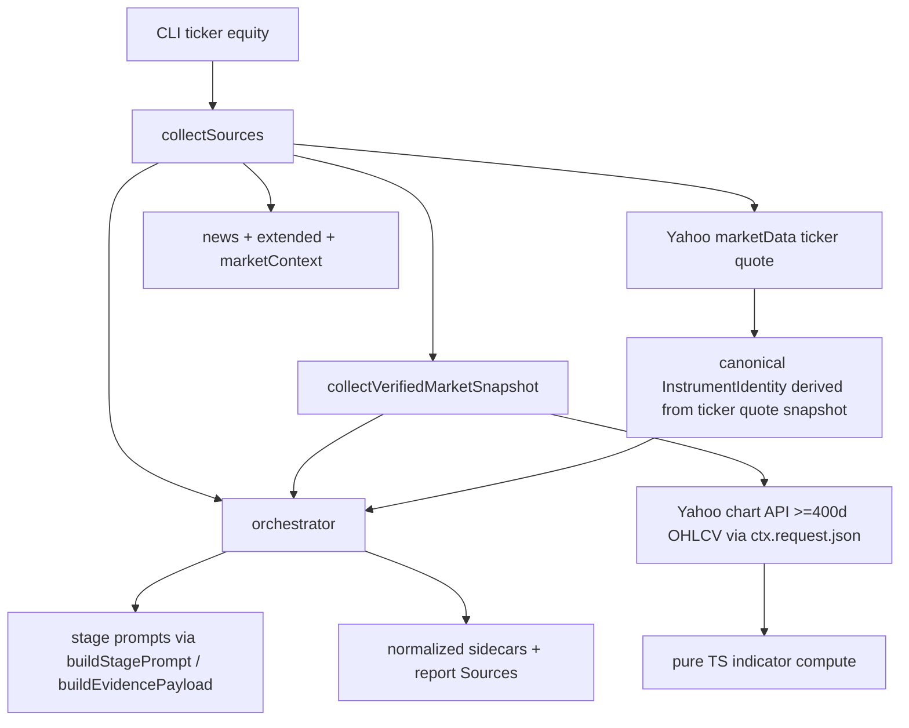

# Handoff

> For the next agent. **Do not re-read the full TradingAgents review thread** — use this section plus the plan below.

## Session summary

1. Researched [TradingAgents](https://github.com/TauricResearch/TradingAgents) vs **market-bot** and produced a prioritized improvement list (grounding > trade-decision graph).
2. A separate review validated that list; corrections were folded into this plan (see **Review validation** below).
3. Ran **grill-with-docs** — all Phase A scope decisions are locked (see **Locked decisions** below).
4. Plan written here; **no implementation started** — all todos unchecked, ADR 0019 not yet created.
5. 2026-06-11: a second, codebase-verified review corrected the plan in place (ADR renumber, lookback, seam names, cache/fallback rules, identity dedupe) — see **Second review corrections** below.

## What to do next

**Implement Phase A** per this plan, in todo order. Start with ADR 0019 + `CONTEXT.md` glossary entry, then types → Yahoo OHLCV → indicators → collector wiring → prompts → persistence → tests. Gate on `bun run check`.

**Do not** implement Phase A.2 (numeric verification), debate/risk panels, sentiment providers, or checkpoint resume unless explicitly requested.

## Key constraints (non-negotiable)

- **Research-only boundary** — [ADR 0001](../docs/adr/0001-research-only-boundary.md): no buy/sell, sizing, or execution language.
- **Bun + oxc only** — no new Node tooling; no Python `stockstats` port.
- **ADR 0008 tension** — canonical identity is **run-scoped**, not a global Instrument resolver.
- **ADR 0011** — do not add sequential debate rounds without a new ADR revisiting latency/independence rationale.

## Open housekeeping

- **ADR number is 0019.** 0018 is already taken by [docs/adr/0018-run-artifact-index.md](../docs/adr/0018-run-artifact-index.md) (run artifact index, merged after this plan was written). [plans/semantic-search-feasibility.md](./semantic-search-feasibility.md) still says "next number is 0018" for embeddings — that plan should use 0020; fix it when that plan is next touched.
- [docs/architecture.md](../docs/architecture.md) line 15 omits Anthropic; fix as part of this work.

## Code seams to know (starting points)

| Area | Path |
|---|---|
| Source collection | [src/sources/collector.ts](../src/sources/collector.ts) |
| Yahoo chart (closes only today) | [src/sources/yahoo.ts](../src/sources/yahoo.ts) (`YAHOO_CHART_URL`, `fetchYahooCloseWindow`) |
| Stage prompts / context | [src/research/research-context.ts](../src/research/research-context.ts) |
| Orchestrator | [src/research/orchestrator.ts](../src/research/orchestrator.ts) |
| Prior-miss correction (existing) | [ADR 0015](../docs/adr/0015-instrument-error-correction-ticker-only.md) |
| Source provider contract | [docs/source-provider-contract.md](../docs/source-provider-contract.md) |

## Suggested skills

| Skill | When |
|---|---|
| `implement-plan` | Primary — execute todos in this file |
| `coding-principles` | Keep diff surgical; match existing conventions |
| `javascript-testing-patterns` | Indicator fixtures, collector seam tests |
| `code-quality` / `bun run check` | Before declaring done |
| `grill-with-docs` | Only if scope changes mid-implementation |

## References (read first)

- [AGENTS.md](../AGENTS.md) — repo rules, definition of done
- [CONTEXT.md](../CONTEXT.md) — domain glossary (add **Verified Market Snapshot** here)
- TradingAgents grounding reference: **unverified** — `tradingagents/dataflows/market_data_validator.py` could not be found in the repo (its dataflows layer is `interface.py` / `stockstats_utils.py` / yfinance utils). Verify against the actual repo before citing any file path in the ADR; the design stands on its own without the citation.

---

# Phase A: Verified Market Snapshot + Ticker Identity Grounding

> Status: **Approved plan** — ready for implementation.
> Date: 2026-06-09. Corrected after second codebase-verified review: 2026-06-11.
> Origin: TradingAgents review + grill-with-docs session.
> Related ADR (to write): [docs/adr/0019-verified-market-snapshot.md](../docs/adr/0019-verified-market-snapshot.md)

## Overview

Implement Phase A grounding from the [TradingAgents](https://github.com/TauricResearch/TradingAgents) review: a deterministic **Verified Market Snapshot** (OHLCV + core indicators) and mandatory ticker **Instrument Identity** resolution for equity ticker runs at all depths, with ADR 0019, glossary update, and numeric verification deferred to a follow-up PR.

## Review validation (accepted corrections)

The external review is **accurate**. Incorporate these fixes into execution:

| Review point | Action |
|---|---|
| `build_verified_market_snapshot()` not in README | Citation **unverified** — do not copy a TradingAgents file path into the ADR without checking the repo (see References note above) |
| [architecture.md](../docs/architecture.md) line 15 stale | Fix provider list to include Anthropic |
| #16 audit markdown | **Deferred** — extend existing [history timelines](../src/history/artifacts.ts) later, not Phase A |
| #21 OpenRouter | **Out of scope** — document `openai-compatible` example only if needed; real provider gap is Gemini |
| #6/#7 debate/risk panel | **Out of Phase A** — requires new ADR explicitly revisiting [ADR 0011](../docs/adr/0011-fixed-coverage-panel-for-deep-research.md) latency/independence rationale |
| #3 reflection | **Out of Phase A** — incremental enhancement atop [ADR 0015](../docs/adr/0015-instrument-error-correction-ticker-only.md) `priorThesisErrors` |
| #9 prerequisite for #18 | **In scope** — indicators ship with snapshot; verification pass is Phase A.2 |

## Second review corrections (2026-06-11, codebase-verified)

A follow-up review was verified line-by-line against the code. These corrections are **binding** and already folded into the sections below:

1. **ADR is 0019, not 0018** — `docs/adr/0018-run-artifact-index.md` merged in the meantime.
2. **Lookback fixed** — 252 calendar days ≈ ~172 trading sessions; SMA200 would be permanently null. Now ≥400 calendar days (see Locked decisions).
3. **Seam names corrected** — there is no `buildResearchContextJson`. The injection seams are `buildEvidencePayload()` ([research-context.ts](../src/research/research-context.ts), ~line 505, called from `buildStagePrompt`) and `buildSourceList()` ([report-assembly.ts](../src/research/report-assembly.ts)).
4. **Chart fetches must go through `ctx.request.json`** — `fetchYahooCloseWindow` bypasses the collector cache (calls `fetchYahooJsonWithResilience` directly) *and* silently falls back to Massive closes-only data. Both behaviors are forbidden for the snapshot (§3, §5).
5. **No second quote fetch for identity** — ticker runs already fetch the quote via `requestJsonWithQuoteFallback` in `collectEquity`. Derive identity from that snapshot (§6).
6. **Gap typing exists already** — `SourceGap` has `capability` and `evidenceQualityImpact` fields ([domain/types.ts](../src/domain/types.ts)); the cause enum member is `"validation-failed"` (not `"validation-failure"`). §5 specifies the values to use.

## Locked decisions (grill session; lookback corrected 2026-06-11)

- **Scope:** equity `ticker` runs, **all depths** (brief + deep)
- **Content:** OHLCV + core indicators (EMA10, SMA50/200, RSI, MACD family, Bollinger, ATR)
- **Bundled:** mandatory pre-run Instrument Identity resolution (same change)
- **Lookback:** **≥400 calendar days** of daily bars (~275 trading sessions — enough for SMA200 plus EMA/MACD warmup; the original 252 *calendar* days yielded only ~172 sessions). Latest row = last session on or before run date.
- **Bar thresholds:** ≥60 bars to emit a snapshot at all (core indicators); SMA200 is `null` below 200 bars. Per-indicator failure → `null` for that key, never a dropped snapshot.
- **Gap audit:** minimal only — `SourceGap` on fetch/compute failure; no cross-prompt auditor
- **Verification:** Phase A.2 follow-up PR (post-synthesis numeric check + reprompt)
- **Glossary:** new term **Verified Market Snapshot** in [CONTEXT.md](../CONTEXT.md)
- **ADR:** yes — [docs/adr/0019-verified-market-snapshot.md](../docs/adr/0019-verified-market-snapshot.md) (extends, does not replace, [ADR 0008](../docs/adr/0008-provider-normalized-instrument-identity.md))

## Architecture



### Relationship to existing concepts

- **Not** a `Market Snapshot` (point-in-time quote for movers/regime)
- **Not** an `Observation` in v1 (no scoring promotion; ADR documents deferral)
- **Not** `Extended Evidence` (issuer-specific filings/IV/on-chain)
- **Partial extension of ADR 0008:** one canonical identity block per ticker run, selected from Yahoo at orchestration time — still not a full Instrument resolver/catalog

## Implementation plan

### 1. Domain + ADR + glossary

**ADR 0019** should record:

- Decision: supplemental citeable ground-truth for exact numeric technical claims
- Scope: equity ticker, all depths, Yahoo-only v1 (spotlight/daily/weekly intentionally excluded — record so nobody "fixes" it without a scope change)
- Fixed indicator set with **canonical keys and periods**: RSI(14), MACD(12,26,9), Bollinger(20,2), ATR(14), EMA10, SMA50/200 — lock the key schema now so Phase A.2 numeric verification can match keys, not prose
- Lookback window (≥400 calendar days) and bar thresholds (≥60 emit / ≥200 for SMA200)
- **Date semantics:** `analysisDate` = UTC calendar date of `ctx.fetchedAt`; `latestSessionDate` = date of the last bar ≤ `analysisDate` after filtering. Note the UTC-date caveat for non-US tickers (chart timestamps are converted via UTC date slice)
- **Adjusted vs raw prices:** v1 uses raw OHLCV from `indicators.quote` consistently (ATR needs raw high/low); `adjclose` divergence on split-heavy names is a documented v1 limitation
- **Null-bar handling:** skip bars with any null OHLCV slot (keep all five arrays index-aligned); no forward-fill in v1
- **Citation rule for prompts:** exact indicator values cite the Verified Market Snapshot source only; current-session quote values cite the market snapshot source; never mix quote price with bar-close indicators in one claim (the live quote and the latest bar can legitimately disagree intraday)
- Bundled canonical identity injection (extends ADR 0008 orchestration seam only); identity derived from the existing ticker quote, no second fetch
- Rejected: LLM-computed indicators; promoting indicators to scoring Observations in v1; reusing the `fetchYahooCloseWindow`/Massive closes-only path; folding into `MarketSnapshot`

**[CONTEXT.md](../CONTEXT.md)** — add:

> **Verified Market Snapshot** — A deterministic, analysis-date-anchored OHLCV and technical-indicator ground-truth block for a single Instrument. It is citeable supplemental evidence for exact numeric claims in a Research View. It is not investment conviction, a trade signal, or a scoring Observation unless explicitly promoted later.

**[docs/architecture.md](../docs/architecture.md)** — fix line 15 (`Anthropic`); add Sources subsection for verified snapshot + ticker identity seam.

### 2. Types and normalized artifact shape

Add to [src/domain/types.ts](../src/domain/types.ts) (or adjacent domain module):

```typescript
interface VerifiedMarketSnapshot {
  readonly symbol: string;
  readonly assetClass: "equity";
  readonly analysisDate: string;       // run/report date (YYYY-MM-DD)
  readonly latestSessionDate: string;  // last bar used
  readonly ohlcv: { open, high, low, close, volume };
  readonly indicators: Readonly<Record<string, number | null>>;
  readonly recentCloses: readonly { date: string; close: number }[]; // last ~30 sessions
}
```

Extend [src/sources/types.ts](../src/sources/types.ts) `CollectedSources`:

```typescript
readonly verifiedMarketSnapshot?: VerifiedMarketSnapshot;
readonly resolvedInstrumentIdentity?: InstrumentIdentity;
```

Persist under run artifacts:

- `normalized/verified-market-snapshot.json`
- `normalized/instrument-identity.json` (canonical for this run)

### 3. Yahoo OHLCV extraction (extend existing seam)

[src/sources/yahoo.ts](../src/sources/yahoo.ts) already has `YAHOO_CHART_URL`, `yahooChartWindowUrl`, and `observationsFromYahooChartPayload` (closes only).

- Add `parseYahooChartOhlcv(payload)` returning daily bars `{ date, open, high, low, close, volume }[]`
- Skip bars where **any** OHLCV slot is null (Yahoo emits null slots on halts/sparse names); all five arrays must stay index-aligned — add a fixture test with interior nulls
- Filter bars to `<= analysisDate` (defensive, TradingAgents pattern)
- **Fetch via `ctx.request.json({ url, adapter: "yahoo-verified-chart", fetch: yahooResilientFetchWrapper })`** — the pattern `collectEquity` already uses (yahoo.ts ~line 247). This gives cache, rate limiting, circuit breaking, and stale fallback ([ADR 0017](../docs/adr/0017-yahoo-resilience-massive-fallback.md)). **Do not** call `fetchYahooJsonWithResilience` directly — that bypasses the collector cache.
- **Do not reuse `fetchYahooCloseWindow`** — it bypasses the cache *and* silently falls back to `fetchMassiveCloseWindow` (closes only). Massive cannot satisfy the snapshot: ATR/Bollinger need full OHLCV. On Yahoo chart failure → `SourceGap`, never a degraded snapshot.
- Dedicated adapter id `yahoo-verified-chart` keeps the fetch visible in health traces

### 4. Pure TypeScript indicators module

New module e.g. [src/sources/indicators.ts](../src/sources/indicators.ts) (or `src/indicators/compute.ts`):

- Deterministic implementations: EMA/SMA, RSI(14), MACD(12,26,9), Bollinger(20,2), ATR(14)
- Input: sorted daily bars; output: latest-row indicator map keyed by the **canonical key schema locked in ADR 0019** (e.g. `ema10`, `sma50`, `sma200`, `rsi14`, `macd`, `macdSignal`, `macdHistogram`, `bollUpper`, `bollMiddle`, `bollLower`, `atr14`) — fixed keys make Phase A.2 verification matchable
- **Per-indicator failure policy:** insufficient bars or compute error for one indicator → that key is `null`; never drop the whole snapshot when OHLCV is usable
- Unit tests with fixed bar fixtures (no network) — golden values for a small synthetic series; edge cases: empty bars, single bar, exactly-at-threshold bar counts (59/60, 199/200)
- No new npm dependency (avoid porting Python `stockstats`; keep Bun-only)

### 5. Verified snapshot collector

New file e.g. [src/sources/verified-market-snapshot.ts](../src/sources/verified-market-snapshot.ts):

- `collectVerifiedMarketSnapshot(ctx, symbol, analysisDate): Promise<{ snapshot?, gaps[] }>`
- Lookback: `analysisDate - 400 days` (≥400 calendar days) via chart API
- Guard the gate: `command.symbol` is optional on `ResearchCommand` — skip (no gap) when undefined; never fetch a chart for `""`
- On fetch failure or `< 60` usable bars: emit `SourceGap` with `capability: "market-data"`, `cause: "provider-data-missing"` or `"validation-failed"` (exact enum spelling — there is no `"validation-failure"`), return undefined snapshot — **do not abort run**
- **Evidence quality impact (decide in ADR 0019):** set `evidenceQualityImpact` explicitly — recommended `"core-cap"` for missing snapshot on equity ticker runs, so a run without grounded technicals cannot report `high` evidence quality while numeric claims are unconstrained (A.2 verification lands later). `"no-cap"` is the fallback choice if that proves too strict in practice; either way the choice must be recorded, not defaulted.
- Extend `deterministicSourceGaps` ([research-context.ts](../src/research/research-context.ts) ~line 544) with an explicit equity-ticker message when the snapshot is missing (mirrors the existing missing-market-snapshot pattern)
- Register via new optional capability on Yahoo provider module ([ADR 0009](../docs/adr/0009-source-provider-modules.md)) **or** ticker-only branch in [src/sources/collector.ts](../src/sources/collector.ts) when `command.jobType === "ticker" && command.assetClass === "equity"`

Recommended: **ticker-only branch in collector** for v1 (minimal registry churn); document promotion path to first-class capability in ADR.

Wire in [collectSources](../src/sources/collector.ts) parallel to existing fetches when equity ticker.

### 6. Canonical Instrument Identity resolution

New helper e.g. [src/sources/instrument-identity.ts](../src/sources/instrument-identity.ts):

- **No second quote fetch.** Ticker runs already fetch the quote in `collectEquity` via `requestJsonWithQuoteFallback` (yahoo.ts ~line 359) — a separate fetch would bypass the cache, lose the Massive quote-fallback resilience, and can drift from the marketSnapshot when one call hits Yahoo and the other lands on the fallback.
- `deriveCanonicalInstrumentIdentity(marketSnapshots, symbol): { identity?, gap? }` — pure selection from the already-collected ticker `MarketSnapshot` (reuse the existing `InstrumentIdentity` normalization: `displayName`, `exchange`, `quoteCurrency`, aliases)
- Only if no matching snapshot exists: fall back to one quote fetch **through `ctx.request.json`** (never a raw `fetchImpl`), or emit a gap
- Optionally enrich with `sector` / `industry` if present on the same quote payload (the movers path already reads `sector` — yahoo.ts ~line 132); add optional fields to `InstrumentIdentity` only if Yahoo exposes them consistently
- Called from collector (same ticker gate) so identity is available before orchestrator stages

**ADR 0008 note:** this is orchestration-time canonicalization for one run, not a resolver catalog.

### 7. Prompt + source injection

**[src/research/research-context.ts](../src/research/research-context.ts)** — extend `buildEvidencePayload` (~line 505, called from `buildStagePrompt`; there is **no** `buildResearchContextJson`):

- `verifiedMarketSnapshot` block — **compact form for prompts**: latest OHLCV row, indicator map, and `recentCloses` (~30 sessions) only; the full bar series stays on disk in the sidecar. Deep runs inject the evidence payload into 6+ stages, so payload size compounds.
- `resolvedInstrumentIdentity` block with instruction: *use this identity; do not substitute a different company*
- If snapshot missing, rely on existing `sourceGaps` disclosure via `deterministicSourceGaps` (minimal gap audit)

**[src/research/report-assembly.ts](../src/research/report-assembly.ts)** — add citeable `Source` entry:

- ID pattern: `verified-snapshot-{symbol}` or similar
- Include in `buildSourceList` for ticker runs when snapshot present — required **before** synthesis, since `final-synthesis` validates citations against `allowedSourceIds`

**Prompts** ([prompts/](../prompts/)) — update `specialist-analysis`, Coverage Panel ticker stages, `critique`, `final-synthesis`:

- Require exact OHLCV/indicator numbers to cite the Verified Market Snapshot source ID
- Forbid inventing indicator values not in the snapshot
- **Two-truths rule:** indicator/bar-close values cite the snapshot; current-session price cites the market snapshot quote source; do not mix the two in one claim (they legitimately disagree intraday and across timezone boundaries)

### 8. Orchestrator persistence

**[src/research/orchestrator.ts](../src/research/orchestrator.ts)** / [src/artifacts.ts](../src/artifacts.ts):

- Write normalized sidecars on persist (alongside existing `movers.json`, etc.)
- **Retain the raw chart payload in `rawSnapshots`** (explicit, for replay/debug — same as other sources)
- Include snapshot reference in trace/run analytics if useful ([src/research/run-analytics.ts](../src/research/run-analytics.ts))
- Sidecar carries the canonical indicator keys + `latestSessionDate` so Phase A.2 verification reads structured data, not prompt text

No report schema migration — snapshot lives in extras/sources/normalized sidecars only (matches ADR 0011 pattern).

### 9. Tests

| Area | Tests |
|---|---|
| Indicator math | Fixed fixtures, edge cases (empty bars, single bar, bar counts at thresholds 59/60 and 199/200 → per-indicator nulls) |
| Yahoo OHLCV parse | Fixture JSON from chart API shape, including interior null OHLCV slots (skip-bar policy, arrays stay aligned) |
| Collector wiring | Equity ticker collects snapshot; daily/weekly/crypto/alpha-search skip; undefined `command.symbol` skips without gap |
| SourceGap on failure | Mock fetch failure → gap with `capability`/`cause`/`evidenceQualityImpact` set, run continues; **no Massive fallback attempted** |
| Prompt context | Snapshot + identity appear in `buildEvidencePayload` output; missing snapshot → gap line present |
| Report sources | Snapshot source ID in `buildSourceList`; synthesis citing the snapshot ID passes `allowedSourceIds` validation, unknown ID fails |
| Identity | Derived from existing ticker `MarketSnapshot` (no extra fetch in the happy path); canonical identity overrides ambiguous ticker-only context |

Run `bun run check` before merge.

### 10. Docs touch-ups (in scope)

- [docs/configuration.md](../docs/configuration.md) — only if new env vars added (default: none; the 400-day lookback is a named constant, not config)
- [docs/source-provider-contract.md](../docs/source-provider-contract.md) — short pointer to Verified Market Snapshot as supplemental normalized shape
- Fix [architecture.md](../docs/architecture.md) Anthropic line

## Implementation todos

- [ ] Write ADR 0019 (Verified Market Snapshot + ticker canonical identity; includes indicator key schema, date semantics, raw-price + null-bar policy, quality-cap choice, Massive exclusion); update CONTEXT.md glossary
- [ ] Add VerifiedMarketSnapshot type; extend CollectedSources + normalized artifact writers
- [ ] Extend yahoo.ts chart parsing for full OHLCV bars (null-slot skip, analysis-date cutoff); fetch via `ctx.request.json` with adapter `yahoo-verified-chart`
- [ ] Implement pure TS indicator compute module (canonical keys, per-indicator nulls) + golden fixture tests
- [ ] Wire snapshot collection + identity derivation (from existing ticker quote) for equity ticker in collector.ts; extend `deterministicSourceGaps`
- [ ] Inject snapshot/identity into `buildEvidencePayload`, `buildSourceList`, and stage prompts (incl. two-truths citation rule)
- [ ] Persist normalized sidecars + raw chart payload; update architecture.md (Anthropic + new subsystem)
- [ ] Collector + prompt + source list integration tests (incl. `allowedSourceIds` validation); run `bun run check`

## Explicitly out of Phase A

| Item | When / condition |
|---|---|
| Post-synthesis numeric verification (#18) | **Phase A.2** — reprompt loop like [final-synthesis.ts](../src/research/final-synthesis.ts) |
| Full pre-LLM gap audit (#17) | Phase A.3 |
| History timeline lesson entries (#16) | Extend [history rebuild](../src/history/artifacts.ts) after reflection design |
| LLM narrative reflection (#3) | After Phase A.2; builds on ADR 0015 |
| Bull/bear debate / risk panel (#6/#7) | New ADR revisiting ADR 0011 |
| Checkpoint resume (#15) | Separate ops ADR |
| Sentiment providers (StockTwits/Reddit) | Phase B |
| Gemini provider | Docs-only / future |
| Scoring Observation promotion for RSI etc. | Future; requires [forecast/observable.ts](../src/forecast/observable.ts) + resolver work |

## Phase A.2 preview (follow-up PR, not this change)

1. Extract numeric claims from final report (structured fields first, then regex for `$NNN.NN`, `%`, indicator names)
2. Compare against `VerifiedMarketSnapshot` + `MarketSnapshot` with tolerance (e.g. 0.5% relative, 2 decimal places for indicators)
3. On mismatch: reprompt `final-synthesis` with validation errors (reuse existing reprompt pattern)
4. Tests: fabricated RSI in synthesis → caught and reprompted

## Risk notes

- **Yahoo chart rate limits:** all chart fetches go through `ctx.request.json` (cache, rate limit, circuit breaker, stale fallback) — note this is **not** what `fetchYahooCloseWindow` does today, hence the new fetch path in §3
- **Silent degradation:** the existing chart helper falls back to Massive closes-only data; the snapshot path must gap instead — a degraded snapshot is worse than a disclosed gap
- **ADR 0008 tension:** document clearly that canonical identity is run-scoped, not a global resolver
- **Two price truths:** live quote vs latest bar close can disagree intraday — mitigated by the citation rule in §7 / ADR 0019
- **International tickers:** UTC date slicing of chart timestamps can shift session dates for non-US exchanges; Yahoo-only v1 limitation, gap-don't-abort
- **Brief ticker cost:** one extra chart fetch + indicator compute per run — acceptable for grounding; monitor via existing run analytics token/cost fields

## Success criteria

- Equity ticker run (brief and deep) persists `normalized/verified-market-snapshot.json` with OHLCV + indicators when Yahoo succeeds
- Every stage prompt receives identity + snapshot (or gap disclosure)
- Final report cites snapshot source when stating exact technical numbers (prompt-enforced; hard verification in A.2)
- `bun run check` passes; ADR 0019 + CONTEXT.md updated
