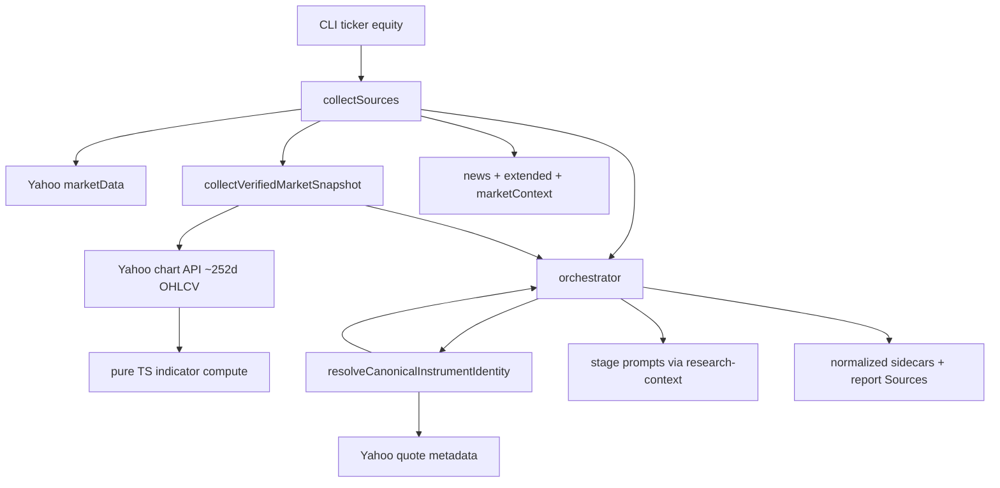

# Handoff

> For the next agent. **Do not re-read the full TradingAgents review thread** — use this section plus the plan below.

## Session summary

1. Researched [TradingAgents](https://github.com/TauricResearch/TradingAgents) vs **market-bot** and produced a prioritized improvement list (grounding > trade-decision graph).
2. A separate review validated that list; corrections were folded into this plan (see **Review validation** below).
3. Ran **grill-with-docs** — all Phase A scope decisions are locked (see **Locked decisions** below).
4. Plan written here; **no implementation started** — all todos unchecked, ADR 0018 not yet created.

## What to do next

**Implement Phase A** per this plan, in todo order. Start with ADR 0018 + `CONTEXT.md` glossary entry, then types → Yahoo OHLCV → indicators → collector wiring → prompts → persistence → tests. Gate on `bun run check`.

**Do not** implement Phase A.2 (numeric verification), debate/risk panels, sentiment providers, or checkpoint resume unless explicitly requested.

## Key constraints (non-negotiable)

- **Research-only boundary** — [ADR 0001](../docs/adr/0001-research-only-boundary.md): no buy/sell, sizing, or execution language.
- **Bun + oxc only** — no new Node tooling; no Python `stockstats` port.
- **ADR 0008 tension** — canonical identity is **run-scoped**, not a global Instrument resolver.
- **ADR 0011** — do not add sequential debate rounds without a new ADR revisiting latency/independence rationale.

## Open housekeeping

- **ADR number 0018** is reserved here for Verified Market Snapshot. [plans/semantic-search-feasibility.md](./semantic-search-feasibility.md) also mentions 0018 for embeddings (exploratory) — reconcile before merging either ADR.
- [docs/architecture.md](../docs/architecture.md) line 15 omits Anthropic; fix as part of this work.

## Code seams to know (starting points)

| Area | Path |
|---|---|
| Source collection | [src/sources/collector.ts](../src/sources/collector.ts) |
| Yahoo chart (closes only today) | [src/sources/yahoo.ts](../src/sources/yahoo.ts) (`YAHOO_CHART_URL`, `fetchYahooCloseWindow`) |
| Stage prompts / context | [src/research/research-context.ts](../src/research/research-context.ts) |
| Orchestrator | [src/research/orchestrator.ts](../src/research/orchestrator.ts) |
| Prior-miss correction (existing) | [ADR 0015](../docs/adr/0015-instrument-error-correction-ticker-only.md) |
| Source provider contract | [docs/source-provider-contract.md](../docs/source-provider-contract.md) |

## Suggested skills

| Skill | When |
|---|---|
| `implement-plan` | Primary — execute todos in this file |
| `coding-principles` | Keep diff surgical; match existing conventions |
| `javascript-testing-patterns` | Indicator fixtures, collector seam tests |
| `code-quality` / `bun run check` | Before declaring done |
| `grill-with-docs` | Only if scope changes mid-implementation |

## References (read first)

- [AGENTS.md](../AGENTS.md) — repo rules, definition of done
- [CONTEXT.md](../CONTEXT.md) — domain glossary (add **Verified Market Snapshot** here)
- TradingAgents grounding reference (source, not README): `tradingagents/dataflows/market_data_validator.py` on GitHub

---

# Phase A: Verified Market Snapshot + Ticker Identity Grounding

> Status: **Approved plan** — ready for implementation.
> Date: 2026-06-09. Origin: TradingAgents review + grill-with-docs session.
> Related ADR (to write): [docs/adr/0018-verified-market-snapshot.md](../docs/adr/0018-verified-market-snapshot.md)

## Overview

Implement Phase A grounding from the [TradingAgents](https://github.com/TauricResearch/TradingAgents) review: a deterministic **Verified Market Snapshot** (OHLCV + core indicators) and mandatory ticker **Instrument Identity** resolution for equity ticker runs at all depths, with ADR 0018, glossary update, and numeric verification deferred to a follow-up PR.

## Review validation (accepted corrections)

The external review is **accurate**. Incorporate these fixes into execution:

| Review point | Action |
|---|---|
| `build_verified_market_snapshot()` not in README | Cite as **TradingAgents source** (`tradingagents/dataflows/market_data_validator.py`), not README |
| [architecture.md](../docs/architecture.md) line 15 stale | Fix provider list to include Anthropic |
| #16 audit markdown | **Deferred** — extend existing [history timelines](../src/history/artifacts.ts) later, not Phase A |
| #21 OpenRouter | **Out of scope** — document `openai-compatible` example only if needed; real provider gap is Gemini |
| #6/#7 debate/risk panel | **Out of Phase A** — requires new ADR explicitly revisiting [ADR 0011](../docs/adr/0011-fixed-coverage-panel-for-deep-research.md) latency/independence rationale |
| #3 reflection | **Out of Phase A** — incremental enhancement atop [ADR 0015](../docs/adr/0015-instrument-error-correction-ticker-only.md) `priorThesisErrors` |
| #9 prerequisite for #18 | **In scope** — indicators ship with snapshot; verification pass is Phase A.2 |

## Locked decisions (grill session)

- **Scope:** equity `ticker` runs, **all depths** (brief + deep)
- **Content:** OHLCV + core indicators (EMA10, SMA50/200, RSI, MACD family, Bollinger, ATR)
- **Bundled:** mandatory pre-run Instrument Identity resolution (same change)
- **Lookback:** ~252 calendar days of daily bars; latest row = last session on or before run date
- **Gap audit:** minimal only — `SourceGap` on fetch/compute failure; no cross-prompt auditor
- **Verification:** Phase A.2 follow-up PR (post-synthesis numeric check + reprompt)
- **Glossary:** new term **Verified Market Snapshot** in [CONTEXT.md](../CONTEXT.md)
- **ADR:** yes — [docs/adr/0018-verified-market-snapshot.md](../docs/adr/0018-verified-market-snapshot.md) (extends, does not replace, [ADR 0008](../docs/adr/0008-provider-normalized-instrument-identity.md))

## Architecture



### Relationship to existing concepts

- **Not** a `Market Snapshot` (point-in-time quote for movers/regime)
- **Not** an `Observation` in v1 (no scoring promotion; ADR documents deferral)
- **Not** `Extended Evidence` (issuer-specific filings/IV/on-chain)
- **Partial extension of ADR 0008:** one canonical identity block per ticker run, selected from Yahoo at orchestration time — still not a full Instrument resolver/catalog

## Implementation plan

### 1. Domain + ADR + glossary

**ADR 0018** should record:

- Decision: supplemental citeable ground-truth for exact numeric technical claims
- Scope: equity ticker, all depths, Yahoo-only v1
- Fixed indicator set and lookback window
- Bundled canonical identity injection (extends ADR 0008 orchestration seam only)
- Rejected: LLM-computed indicators; promoting indicators to scoring Observations in v1; reusing Massive-only path; folding into `MarketSnapshot`

**[CONTEXT.md](../CONTEXT.md)** — add:

> **Verified Market Snapshot** — A deterministic, analysis-date-anchored OHLCV and technical-indicator ground-truth block for a single Instrument. It is citeable supplemental evidence for exact numeric claims in a Research View. It is not investment conviction, a trade signal, or a scoring Observation unless explicitly promoted later.

**[docs/architecture.md](../docs/architecture.md)** — fix line 15 (`Anthropic`); add Sources subsection for verified snapshot + ticker identity seam.

### 2. Types and normalized artifact shape

Add to [src/domain/types.ts](../src/domain/types.ts) (or adjacent domain module):

```typescript
interface VerifiedMarketSnapshot {
  readonly symbol: string;
  readonly assetClass: "equity";
  readonly analysisDate: string;       // run/report date (YYYY-MM-DD)
  readonly latestSessionDate: string;  // last bar used
  readonly ohlcv: { open, high, low, close, volume };
  readonly indicators: Readonly<Record<string, number | null>>;
  readonly recentCloses: readonly { date: string; close: number }[]; // last ~30 sessions
}
```

Extend [src/sources/types.ts](../src/sources/types.ts) `CollectedSources`:

```typescript
readonly verifiedMarketSnapshot?: VerifiedMarketSnapshot;
readonly resolvedInstrumentIdentity?: InstrumentIdentity;
```

Persist under run artifacts:

- `normalized/verified-market-snapshot.json`
- `normalized/instrument-identity.json` (canonical for this run)

### 3. Yahoo OHLCV extraction (extend existing seam)

[src/sources/yahoo.ts](../src/sources/yahoo.ts) already has `YAHOO_CHART_URL`, `yahooChartWindowUrl`, and `observationsFromYahooChartPayload` (closes only).

- Add `parseYahooChartOhlcv(payload)` returning daily bars `{ date, open, high, low, close, volume }[]`
- Filter bars to `<= analysisDate` (defensive, TradingAgents pattern)
- Reuse existing resilience wrapper ([ADR 0017](../docs/adr/0017-yahoo-resilience-massive-fallback.md)) for chart fetches
- **Do not** use closes-only path for snapshot — full OHLCV required for ATR/Bollinger

### 4. Pure TypeScript indicators module

New module e.g. [src/sources/indicators.ts](../src/sources/indicators.ts) (or `src/indicators/compute.ts`):

- Deterministic implementations: EMA/SMA, RSI(14), MACD(12,26,9), Bollinger(20,2), ATR(14)
- Input: sorted daily bars; output: latest-row indicator map matching TradingAgents' default set
- Unit tests with fixed bar fixtures (no network) — golden values for a small synthetic series
- No new npm dependency (avoid porting Python `stockstats`; keep Bun-only)

### 5. Verified snapshot collector

New file e.g. [src/sources/verified-market-snapshot.ts](../src/sources/verified-market-snapshot.ts):

- `collectVerifiedMarketSnapshot(ctx, symbol, analysisDate): Promise<{ snapshot?, gaps[] }>`
- Lookback: `analysisDate - 252 days` via chart API
- On insufficient bars: emit `SourceGap` (`provider-data-missing` / `validation-failure`), return undefined snapshot — **do not abort run**
- Register via new optional capability on Yahoo provider module ([ADR 0009](../docs/adr/0009-source-provider-modules.md)) **or** ticker-only branch in [src/sources/collector.ts](../src/sources/collector.ts) when `command.jobType === "ticker" && command.assetClass === "equity"`

Recommended: **ticker-only branch in collector** for v1 (minimal registry churn); document promotion path to first-class capability in ADR.

Wire in [collectSources](../src/sources/collector.ts) parallel to existing fetches when equity ticker.

### 6. Canonical Instrument Identity resolution

New helper e.g. [src/sources/instrument-identity.ts](../src/sources/instrument-identity.ts):

- `resolveCanonicalInstrumentIdentity(symbol, fetchImpl): Promise<{ identity?, gap? }>`
- Single Yahoo quote/info fetch (reuse normalization from [yahoo.ts](../src/sources/yahoo.ts) `InstrumentIdentity` fields: `displayName`, `exchange`, `quoteCurrency`, aliases)
- Optionally enrich with `sector` / `industry` if available from quote payload (add optional fields to `InstrumentIdentity` only if Yahoo exposes them consistently)
- Called from collector (same ticker gate) so identity is available before orchestrator stages

**ADR 0008 note:** this is orchestration-time canonicalization for one run, not a resolver catalog.

### 7. Prompt + source injection

**[src/research/research-context.ts](../src/research/research-context.ts)** — extend `buildResearchContextJson`:

- `verifiedMarketSnapshot` block (structured JSON + human-readable markdown table for prompts)
- `resolvedInstrumentIdentity` block with instruction: *use this identity; do not substitute a different company*
- If snapshot missing, rely on existing `sourceGaps` disclosure (minimal gap audit)

**[src/research/report-assembly.ts](../src/research/report-assembly.ts)** — add citeable `Source` entry:

- ID pattern: `verified-snapshot-{symbol}` or similar
- Include in `buildSourceList` for ticker runs when snapshot present

**Prompts** ([prompts/](../prompts/)) — update `specialist-analysis`, Coverage Panel ticker stages, `critique`, `final-synthesis`:

- Require exact OHLCV/indicator numbers to cite the Verified Market Snapshot source ID
- Forbid inventing indicator values not in the snapshot

### 8. Orchestrator persistence

**[src/research/orchestrator.ts](../src/research/orchestrator.ts)** / [src/artifacts.ts](../src/artifacts.ts):

- Write normalized sidecars on persist (alongside existing `movers.json`, etc.)
- Include snapshot reference in trace/run analytics if useful ([src/research/run-analytics.ts](../src/research/run-analytics.ts))

No report schema migration — snapshot lives in extras/sources/normalized sidecars only (matches ADR 0011 pattern).

### 9. Tests

| Area | Tests |
|---|---|
| Indicator math | Fixed fixtures, edge cases (empty bars, single bar) |
| Yahoo OHLCV parse | Fixture JSON from chart API shape |
| Collector wiring | Equity ticker collects snapshot; daily/weekly/crypto skip |
| SourceGap on failure | Mock fetch failure → gap, run continues |
| Prompt context | Snapshot + identity appear in `buildResearchContextJson` |
| Report sources | Snapshot source ID in `buildSourceList` |
| Identity | Canonical identity overrides ambiguous ticker-only context |

Run `bun run check` before merge.

### 10. Docs touch-ups (in scope)

- [docs/configuration.md](../docs/configuration.md) — only if new env vars added (default: none for 252-day lookback)
- [docs/source-provider-contract.md](../docs/source-provider-contract.md) — short pointer to Verified Market Snapshot as supplemental normalized shape
- Fix [architecture.md](../docs/architecture.md) Anthropic line

## Implementation todos

- [ ] Write ADR 0018 (Verified Market Snapshot + ticker canonical identity); update CONTEXT.md glossary
- [ ] Add VerifiedMarketSnapshot type; extend CollectedSources + normalized artifact writers
- [ ] Extend yahoo.ts chart parsing for full OHLCV bars with analysis-date cutoff
- [ ] Implement pure TS indicator compute module + golden fixture tests
- [ ] Wire snapshot + identity collection for equity ticker in collector.ts
- [ ] Inject snapshot/identity into research-context, report-assembly, and stage prompts
- [ ] Persist normalized sidecars; update architecture.md (Anthropic + new subsystem)
- [ ] Collector + prompt + source list integration tests; run `bun run check`

## Explicitly out of Phase A

| Item | When / condition |
|---|---|
| Post-synthesis numeric verification (#18) | **Phase A.2** — reprompt loop like [final-synthesis.ts](../src/research/final-synthesis.ts) |
| Full pre-LLM gap audit (#17) | Phase A.3 |
| History timeline lesson entries (#16) | Extend [history rebuild](../src/history/artifacts.ts) after reflection design |
| LLM narrative reflection (#3) | After Phase A.2; builds on ADR 0015 |
| Bull/bear debate / risk panel (#6/#7) | New ADR revisiting ADR 0011 |
| Checkpoint resume (#15) | Separate ops ADR |
| Sentiment providers (StockTwits/Reddit) | Phase B |
| Gemini provider | Docs-only / future |
| Scoring Observation promotion for RSI etc. | Future; requires [forecast/observable.ts](../src/forecast/observable.ts) + resolver work |

## Phase A.2 preview (follow-up PR, not this change)

1. Extract numeric claims from final report (structured fields first, then regex for `$NNN.NN`, `%`, indicator names)
2. Compare against `VerifiedMarketSnapshot` + `MarketSnapshot` with tolerance (e.g. 0.5% relative, 2 decimal places for indicators)
3. On mismatch: reprompt `final-synthesis` with validation errors (reuse existing reprompt pattern)
4. Tests: fabricated RSI in synthesis → caught and reprompted

## Risk notes

- **Yahoo chart rate limits:** reuse collector cache + resilience; snapshot shares cache key with chart URL canonicalization
- **ADR 0008 tension:** document clearly that canonical identity is run-scoped, not a global resolver
- **Brief ticker cost:** one extra chart fetch + indicator compute per run — acceptable for grounding; monitor via existing run analytics token/cost fields

## Success criteria

- Equity ticker run (brief and deep) persists `normalized/verified-market-snapshot.json` with OHLCV + indicators when Yahoo succeeds
- Every stage prompt receives identity + snapshot (or gap disclosure)
- Final report cites snapshot source when stating exact technical numbers (prompt-enforced; hard verification in A.2)
- `bun run check` passes; ADR 0018 + CONTEXT.md updated
